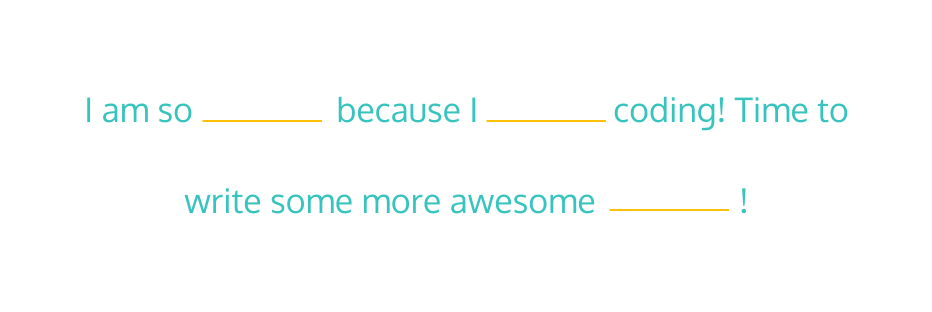

# **Kelvin Weather**

The Kelvin Weather script converts temperature from kelvin to fahrenheit. This training project, prepared by [Codecademy](https://www.codecademy.com/learn/introduction-to-javascript), has been an invaluable exercise in using variables and arithmetic operators using JavaScript.

## Table of Contents

- [Project Prompt](#project-prompt)
  - [canIvote](#canivote)
  - [agreeOrDisagree](#agreeordisagree)
  - [lifePhase](#lifephase)
  - [finalGrade](#finalgrade)
  - [reportingForDuty](#reportingforduty)
  - [Fix The Broken Code 1](#fix-the-broken-code-1)
  - [calculateWeight](#calculateweight)
  - [truthyOrFalsy](#truthyorfalsy)
  - [numImaginaryFriends](#numimaginaryfriends)
  - [sillySentence](#sillysentence)
  - [howOld](#howold)
  - [Fix The Broken Code 2](#fix-the-broken-code-2)
  - [tipCalculator](#tipcalculator)
  - [toEmoticon](#toemoticon)
- [Technologies](#technologies)
- [Setup](#setup)
- [Sources](#sources)

## Project Prompt

You know a bunch about JavaScript syntax, control flow, and functions! The best way to reinforce these skills is through practice. We’ve created a series of problems designed to use your JavaScript knowledge. We encourage you to review relevant lessons, look things up in the [documentation](https://developer.mozilla.org/en-US/docs/Web/JavaScript/Reference), check out the hints and solution code if you get stuck, and, most of all, have fun!

---

### canIVote

The most common minimum age to vote is 18. Write a function `canIVote()` that takes in a number, representing the person’s age, and returns the boolean `true` if they are 18 years old or older, and the boolean `false` if they are not.

---

### agreeOrDisagree

Write a function, `agreeOrDisagree()`, that takes in two strings, and returns `'You agree!'` if the two strings are the same and `'You disagree!'` if the two strings are different.

---

### lifePhase

Write a function, lifePhase(), that takes in a person’s age, as a number, and returns which phase of life they are in.

Here are the classifications:

- 0-3 should return `'baby'`
- 4-12 should return `'child'`
- 13-19 should return `'teen'`
- 20-64 should return `'adult'`
- 65-140 should return `'senior citizen'`
- If the number is less than 0 or greater than 140, the program should return `'This is not a valid age'`

---

### finalGrade

Write a function, `finalGrade()`. It should:

- take three arguments of type number
- find the `average` of those three numbers
- return the letter grade (as a string) that the `average` corresponds to
  - 0-59 should return: `'F'`
  - 60-69 should return: `'D'`
  - 70-79 should return: `'C'`
  - 80-89 should return: `'B'`
  - 90-100 should return: `'A'`
- return `‘You have entered an invalid grade.’` if any of the three grades are less than 0 or greater than 100

---

### reportingForDuty

Write a function, `reportingForDuty()`, that has two string parameters, `rank` and `lastName`, and returns a string in the following format: ‘rank lastName reporting for duty!’

```js
reportingForDuty('Private', 'Fido') 
// Should return 'Private Fido reporting for duty!'
```

---

### Fix The Broken Code 1

We wrote a function, `rollTheDice()`, which is supposed to simulate two dice being rolled and totalled. It’s close to doing what we want, but there’s something not quite right. Can you fix our code, please?

```js
const rollTheDice = () => {
  // Math.random() gives us a random number from 0 up to, but not including, 1
  // We multiplied that by 6 to get a number between 0 and up to, but not including, 6
  // But since we actually wanted numbers from 1 to 6, inclusive, we added 1
    let die1 = Math.random() * 6 + 1
    let die2 = Math.random() * 6 + 1
    return die1 + die2
}
```

---

### calculateWeight

Though an object’s mass remains consistent throughout the universe, weight is determined by the force of gravity on an object. Since different planets have different gravity, the same object would weigh different amounts on each of those planets! Cool, huh?

Write a function, `calculateWeight()`. It should:

- have two parameters: `earthWeight` and `planet`
- expect `earthWeight` to be a number
- expect `planet` to be a string
- return a number representing what that Earth-weight would equate to on the `planet` passed in.

Handle the following cases:

- `'Mercury'` weight = `earthWeight` * 0.378
- `'Venus'` weight = `earthWeight` * 0.907
- `'Mars'` weight = `earthWeight` * 0.377
- `'Jupiter'` weight = `earthWeight` * 2.36
- `'Saturn'` weight = `earthWeight` * 0.916
- For all other inputs, return `'Invalid Planet Entry. Try: Mercury, Venus, Mars, Jupiter, or Saturn.'`

---

### truthyOrFalsy

It can be hard to keep track of what’s truthy or falsy in JavaScript. Write a function, `truthyOrFalsy()`, that takes in any value and returns `true` if that value is truthy and `false` if that value is falsy.

---

### numImaginaryFriends

A person’s number of imaginary friends are always 25% (or 1/4) of their total friends.

Write a function, `numImaginaryFriends()`, that takes in the total number of friends a person has and returns the number of imaginary friends they have.

---

### sillySentence

Write a function, `sillySentence()`, that has 3 string parameters and returns the following silly sentence with the blanks filled in by the arguments passed into the function:



```js
sillySentence('excited', 'love', 'functions'); 
// Should return 'I am so excited because I love coding! Time to write some more awesome functions!'
```

---

### howOld

Write a function, `howOld()`, that has two number parameters, `age` and `year`, and returns how old someone who is currently that `age` was (or will be) during that `year`. Handle three different cases:

If the year is in the future, you should return a string in the following format:

```js
'You will be [calculated age] in the year [year passed in]'
```

If the year is before they were born, you should return a string in the following format:

```js
'The year [year passed in] was [calculated number of years] years before you were born'
```

If the year is in the past but not before the person was born, you should return a string in the following format:

```js
'You were [calculated age] in the year [year passed in]'
```

---

### Fix The Broken Code 2

Given the percentage of DNA shared between two people, you can [calculate their likely familial relationship](https://isogg.org/wiki/Autosomal_DNA_statistics).

We wrote a function, `whatRelation()`, that has one number parameter, `percentSharedDNA`, and returns the likely relationship. We expect the number passed in to always be an integer from 0 to 100, but for some reason it’s not working!

Here’s how it’s supposed to calculate the relationship:

- 100 should return `'You are likely identical twins.'`
- 35-99 should return `'You are likely parent and child or full siblings.'`
- 14-34 should return `'You are likely grandparent and grandchild, aunt/uncle and niece/nephew, or half siblings.'`
- 6-13 should return `'You are likely 1st cousins.'`
- 3-5 should return `'You are likely 2nd cousins.'`
- 1-2 should return `'You are likely 3rd cousins.'`
- 0 should return `'You are likely not related.'`

Unfortunately, it’s not working how we want!

```js
const whatRelation = percentSharedDNA => {
    if (percentSharedDNA === 100) {
        return 'You are likely identical twins.'
    }
    if (percentSharedDNA > 34) {
        return 'You are likely parent and child or full siblings.'
    }
    if (percentSharedDNA < 13) {
        return 'You are likely grandparent and grandchild, aunt/uncle and niece/nephew, or half siblings.'
    }
    if (percentSharedDNA > 5) {
        return 'You are likely 1st cousins.'
    }
    if (percentSharedDNA > 2) {
        return 'You are likely 2nd cousins.'
    }
    if (percentSharedDNA > 0) {
        return 'You are likely 3rd cousins'
    }
    return 'You are likely not related.'
}

console.log(whatRelation(34)) 
// Should return 'You are likely grandparent and grandchild, aunt/uncle and niece/nephew, or half siblings.'
// But instead it's returning 'You are likely 1st cousins.'
 
console.log(whatRelation(3))
// Should return 'You are likely 2nd cousins.'
// But instead it's returning 'You are likely grandparent and grandchild, aunt/uncle and niece/nephew, or half siblings.'
```

---

### tipCalculator

Create a function, tipCalculator(), that has two parameters, a string representing the quality of the service received and a number representing the total cost.

Return the tip, as a number, based on the following:

- `‘bad’` should return a 5% tip
- `‘ok’` should return a 15% tip
- `‘good’` should return a 20% tip
- `‘excellent’` should return a 30% tip
- all other inputs should default to 18%

```js
tipCalculator('good', 100) // Should return 20
```

---

### toEmoticon

Write a function, toEmoticon(), that takes in a string and returns the corresponding emoticon as a string. Use a switch/case, and cover these cases:

- `'shrug'` should return `'|_{"}_|'`
- `'smiley face'` should return `':)'`
- `'frowny face'` should return `':('`
- `'winky face'` should return `';)'`
- `'heart'` should return `'<3'`
- any other input should return `'|_(* ~ *)_|'`

---

## Technologies

- JavaScript ES6

## Setup

To run this program, you needinstall [Node.js](https://nodejs.org/en/download/) to your machine.

Enter this command to the terminal:

```git
node script.js
```

## Sources

The techniques utilized was based on the lessons taught in [Codecademy's Learn JavaScript Course](https://www.codecademy.com/learn/introduction-to-javascript). The challenge is also provided by Codecademy.
